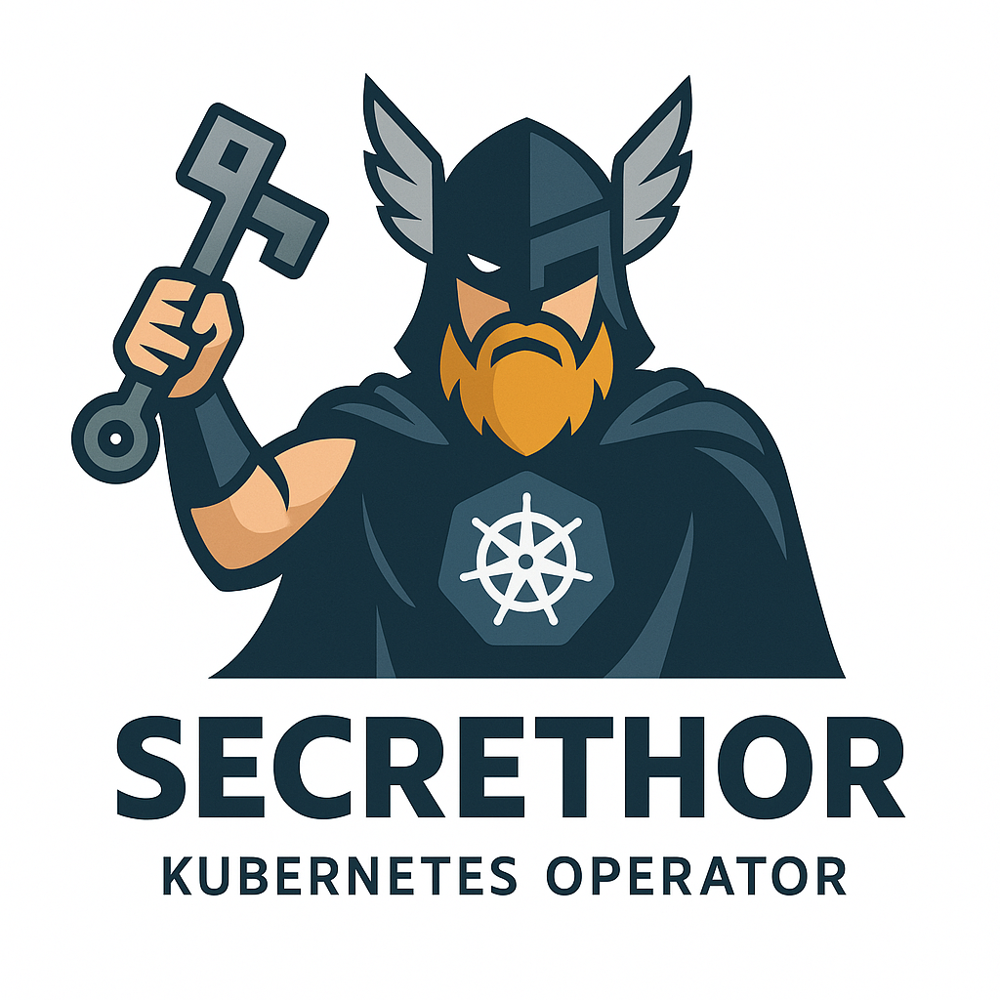

<p align="center">
  
</p>

<p align="center">
  <a href="https://www.apache.org/licenses/LICENSE-2.0"></a>
  <a href="https://goreportcard.com/report/github.com/miltlima/secrethor"></a>
  <a href="https://github.com/miltlima/secrethor/actions"></a>
  <a href="https://github.com/miltlima/secrethor/releases"></a>
  <a href="https://github.com/miltlima/secrethor/commits/main"></a>
  <a href="https://github.com/miltlima/secrethor/issues"></a>
  <a href="https://github.com/miltlima/secrethor/pulls"></a>
  <a href="https://github.com/miltlima/secrethor/stargazers"></a>
  <a href="https://github.com/miltlima/secrethor/network/members"></a>
  <a href="https://pkg.go.dev/github.com/miltlima/secrethor"></a>
  <a href="https://artifacthub.io/packages/helm/secrethor/secrethor"></a>
</p>

# Secrethor

**Secrethor** is a Kubernetes Operator designed to enforce and automate security best practices for secrets management across your Kubernetes clusters. It provides a robust framework for implementing security policies, ensuring compliance, and maintaining operational control over sensitive credentials.

## 🚀 Key Features

- **Real-time Policy Enforcement**
  - Admission webhook for immediate validation of secret creation/updates
  - Declarative policy definitions using Custom Resource Definitions (CRDs)
  - Comprehensive secret validation rules

- **Policy Management**
  - Namespace-based access control (`allowedNamespaces`)
  - Secret lifecycle management (`maxAgeDays`)
  - Type restrictions (`allowedTypes`)
  - Key-level validation (`requiredKeys`, `forbiddenKeys`)
  - Advanced content validation (`valueConstraints`)

- **Security & Compliance**
  - Built-in support for common compliance frameworks
  - Automated secret rotation capabilities
  - Audit logging and monitoring integration

## 📋 Prerequisites

- Kubernetes cluster (v1.11.3+)
- Go (v1.22.0+)
- Docker (17.03+)
- kubectl (v1.11.3+)
- cert-manager (installed on cluster)

## 🛠 Installation

### Using Helm (Recommended)

It enables teams to define `SecretPolicy` CRDs that validate how and where Kubernetes Secrets are created — ensuring governance, compliance, and operational control over sensitive credentials.

#### Step 1: Install without the webhook

```bash
helm repo add secrethor https://miltlima.github.io/secrethor 
```

```bash
helm install secrethor secrethor/secrethor \
  --namespace secrethor-system \
  --create-namespace \
  --set webhook.enabled=false
```

#### Step 2: Enable webhook once pods/services are ready
```bash
helm upgrade secrethor secrethor/secrethor \
  --namespace secrethor-system \
  --set webhook.enabled=true
```

#### Optional: Create namespace via Helm
```yaml
namespace:
  create: true
```

#### Uninstall 
```bash
helm uninstall secrethor --namespace secrethor-system
kubectl delete validatingwebhookconfiguration secrets.secrethor.dev --ignore-not-found
```

### Manual Installation
```bash
# Deploy the operator
make deploy IMG=docker.io/bonovoo/secrethor:latest

# Verify installation
kubectl get pods -n secrethor-system
```

## 📝 Configuration

### Example SecretPolicy

```yaml
apiVersion: secrets.secrethor.dev/v1alpha1
kind: SecretPolicy
metadata:
  name: production-policy
spec:
  allowedNamespaces:
    - production
    - staging
  maxAgeDays: 30
  allowedTypes:
    - Opaque
    - kubernetes.io/basic-auth
    - kubernetes.io/dockerconfigjson
  requiredKeys:
    - username
    - password
  forbiddenKeys:
    - token
    - privateKey
  valueConstraints:
    password:
      minLength: 12
      mustContain:
        - upper
        - lower
        - number
        - special
    username:
      minLength: 4
      regex: "^[a-zA-Z0-9_.-]+$"
```

### Policy Configuration Guide

#### Namespace Management
- `allowedNamespaces`: List of namespaces where secrets can be created
- Use cases:
  - Prevent secrets in untrusted namespaces
  - Enforce namespace-based access control
  - Support multi-tenant environments

#### Secret Lifecycle
- `maxAgeDays`: Maximum age of secrets before rotation
- Benefits:
  - Automated secret rotation ( to be implemented)
  - Reduced risk of long-lived credentials
  - Compliance with security standards

#### Content Validation
- `valueConstraints`: Define rules for secret values
- Supported validations:
  - Minimum length requirements
  - Character type requirements
  - Custom regex patterns
  - Forbidden patterns

- Prevents sensitive secrets from being created in non-secure namespaces
- Encourages security best practices and namespace segmentation
- Helps ensure compliance with standards like PCI, SOC2, ISO, GDPR

If a Secret is created in a namespace not listed in `allowedNamespaces`, Secrethor will deny the request.

---

## 🗺 Roadmap

### Current Development
- [ ] Expired secrets detection
- [ ] Unused secret detection
- [ ] Secret rotation automation
- [ ] Enhanced monitoring capabilities

### Planned Features
- [ ] OLM/OperatorHub support
- [ ] Additional secret store integrations
- [ ] Advanced compliance reporting


## 🤝 Contributing

We welcome contributions from the community! Here's how you can help:

1. Fork the repository
2. Create a feature branch (`git checkout -b feature/amazing-feature`)
3. Commit your changes (`git commit -m 'Add amazing feature'`)
4. Push to the branch (`git push origin feature/amazing-feature`)
5. Open a Pull Request

Please read our [Contributing Guidelines](CONTRIBUTING.md) for more details.

---

## 🪪 License

Apache License - see LICENSE file for details.

---
Built with ❤️ by [Milton Lima de Jesus](https://github.com/miltlima)


