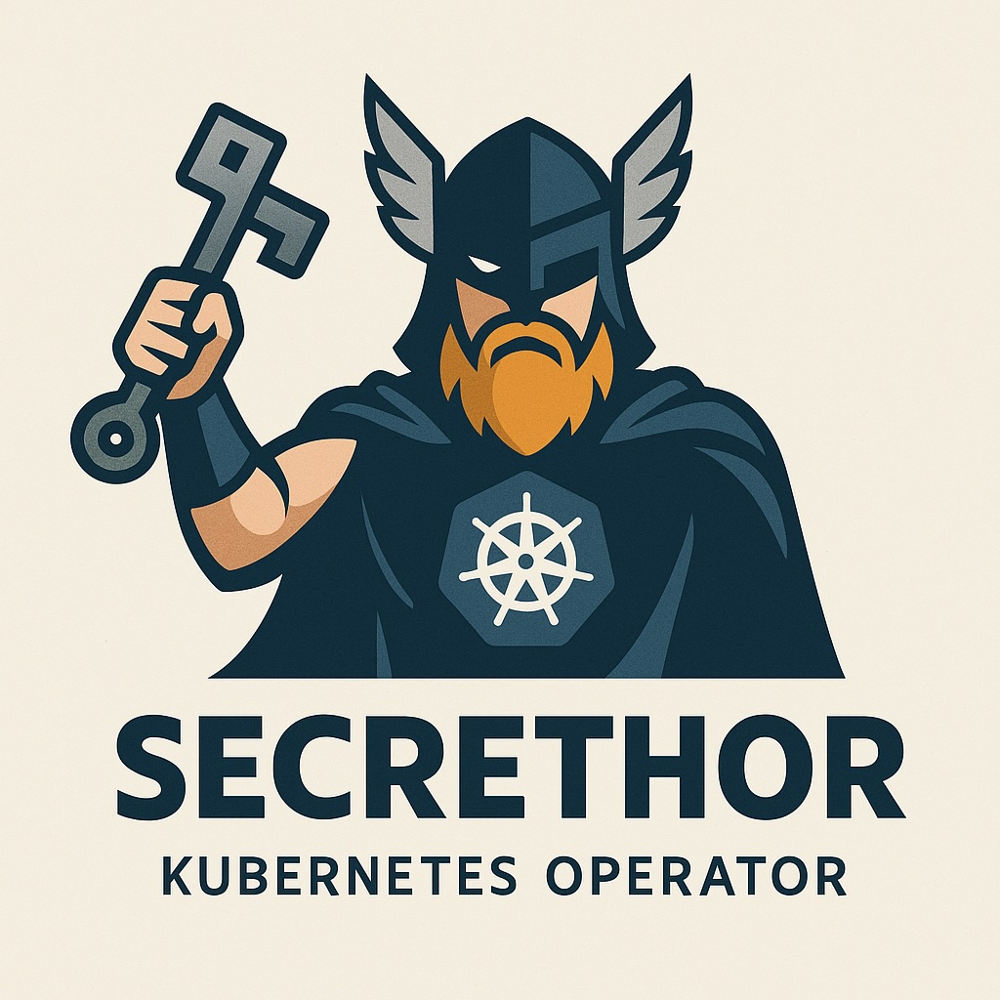

<p align="center">
  
</p>


# secrethor

**Secrethor** is a Kubernetes Operator that manages the lifecycle of secrets across your cluster, enforcing security best practices, governance, and compliance.  

It allows you to define declarative policies to detect expired, unused (orphaned), or mislocated secrets, helping DevOps and SRE teams maintain visibility and control over sensitive assets

## Description
// TODO(user): An in-depth paragraph about your project and overview of use


## Features

- Automatic discovery of all Kubernetes `Secrets`
- Declarative policies with:
  - Maximum age enforcement (`maxAgeDays`)
  - Namespace restrictions (`allowedNamespaces`)
  - Source provider enforcement (`enforceProvider`) — coming soon
- Expired or non-compliant secret detection
- Policy violation logs for visibility
- Built in Go using Operator SDK (extensible architecture)

---

## Example `SecretPolicy` CRD

```yaml
apiVersion: secrets.secrethor.dev/v1alpha1
kind: SecretPolicy
metadata:
  name: default-policy
spec:
  maxAgeDays: 30
  allowedNamespaces:
    - default
    - production
    - secrets-managed
```
## Getting Started

### Prerequisites
- go version v1.22.0+
- docker version 17.03+.
- kubectl version v1.11.3+.
- Access to a Kubernetes v1.11.3+ cluster.

# What Are allowedNamespaces?

The allowedNamespaces field defines which Kubernetes namespaces are authorized to contain Secrets under your organization’s policy.

## Why use it?

 - Prevents sensitive secrets from being created in non-secure namespaces (e.g. dev/test)
 - Encourages security best practices and namespace segmentation
 - Helps ensure compliance with standards like PCI, SOC2, ISO, GDPR

If a secret is found in a namespace not listed in allowedNamespaces, Secrethor will log a policy violation.

Roadmap
	•	Expired secrets detection
	•	Namespace policy enforcement
	•	Unused secret detection
	•	Secret rotation support (Vault, AWS Secrets Manager, SOPS)
	•	Webhook for policy enforcement
	•	Prometheus metrics and Grafana dashboards
	•	Slack/MS Teams alert integration

# Contributing

Contributions are welcome!
If you want to contribute new features, improve documentation, or report a bug — feel free to open an issue or submit a PR.


# License

This project is licensed under the MIT License.


# Author

Milton Lima de Jesus
DevOps/SRE Engineer
linkedin.com/in/miltonlj